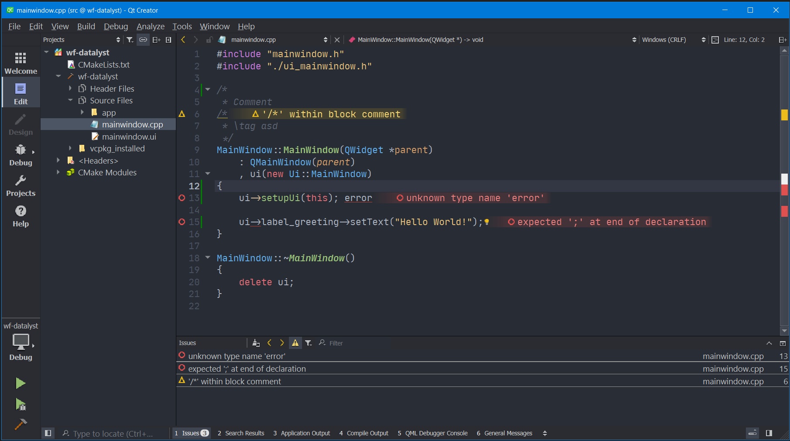
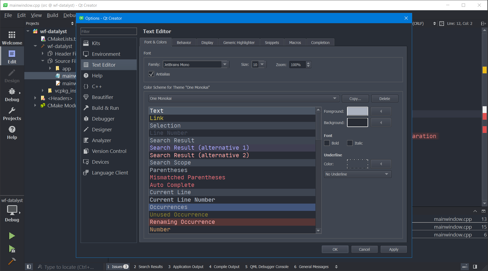

# One Monokai Theme for Qt Creator 4+

This is the One Monokai theme for Qt Creator 4+.

It is based on [One Monokai for Visual Studio Code](https://github.com/azemoh/vscode-one-monokai), which is a cross between Monokai and One Dark.

[Monokai](https://monokai.pro/) was created by [Wimer Hazenberg](https://monokai.nl/) in 2006 for Textmate.

[One Dark](https://github.com/atom/one-dark-ui) was created by Github in 2014 for Atom.

# Installation

#### Theme

- Find your QT Creator installation folder.
  That's were you install the application theme, because it's a non-configurable application ressource.
  If you installed Creator together with Qt it's: `~/Qt/Tools/QtCreator/share/qtcreator/`

- Install the application color-theme (`*.creatortheme`) to `QtCreator/share/qtcreator/themes/`
    - Windows: `xcopy -Y one-monokai.creatortheme C:\Qt\Tools\QtCreator\share\qtcreator\themes\`
    - Linux | Mac: `cp one-monokai.creatortheme ~/Qt/Tools/QtCreator/share/qtcreator/themes`

#### Syntax-Highlighting Color-Scheme
- Find your Qt Creator config folder.
  That's were you install the syntax color-scheme, because you want it to be editable.
- Install the syntax-highlighting color-scheme (`*.xml`) to `qtcreator\styles`
    - Windows: `xcopy -Y one-monokai.xml "%APPDATA%\QtProject\qtcreator\styles\"`
    - Linux | Mac: `cp one-monokai.xml ~/.config/QtProject/qtcreator/styles/`

#### IDE Configuration > Select Theme

- Go to `Qt Creator -> Tools -> Options > Environment`, then in the Tab `Interface` select `Theme`: `One Monokai`

# Screenshots

